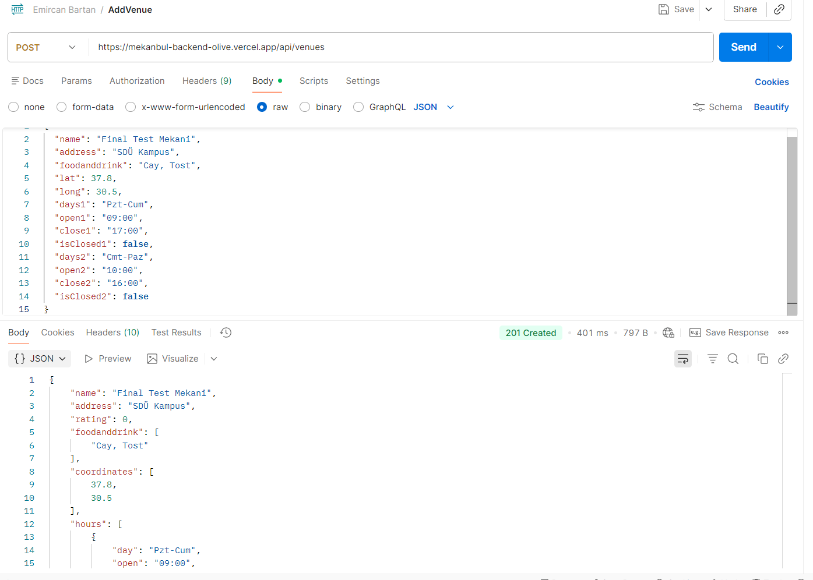
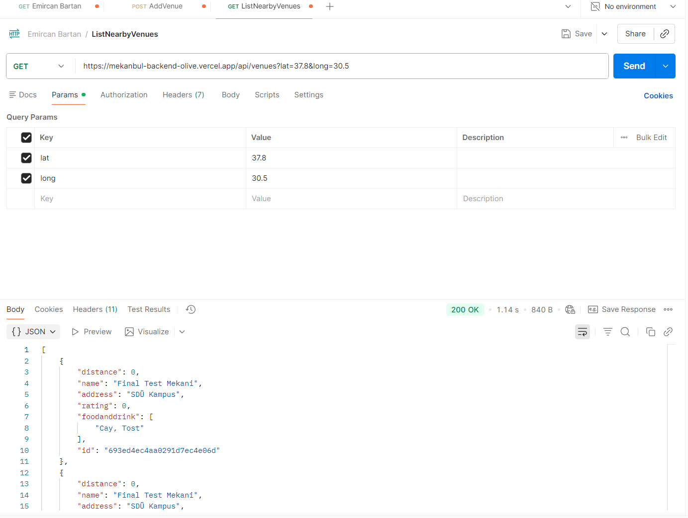
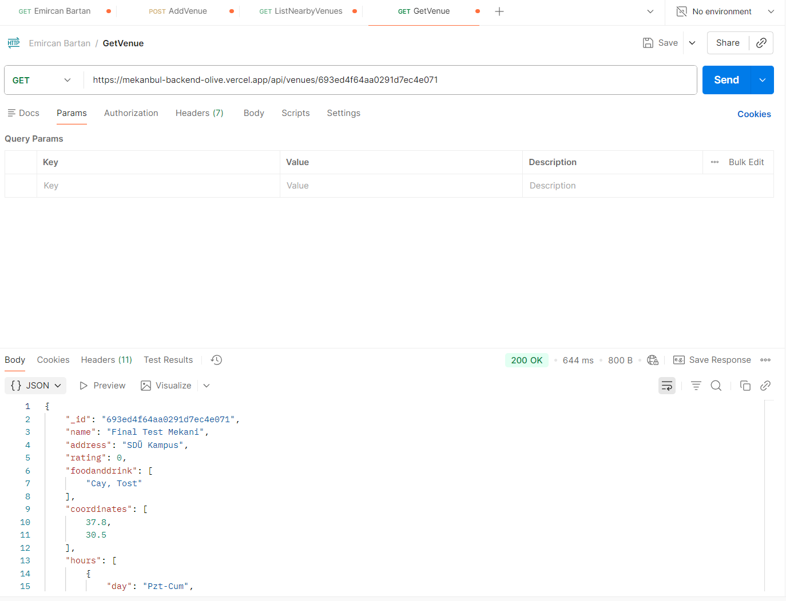
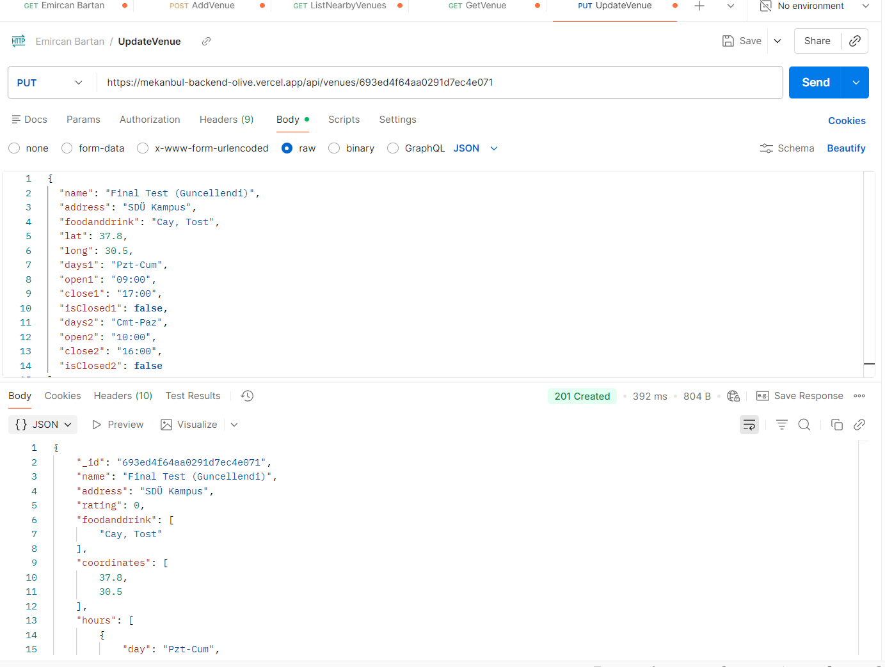
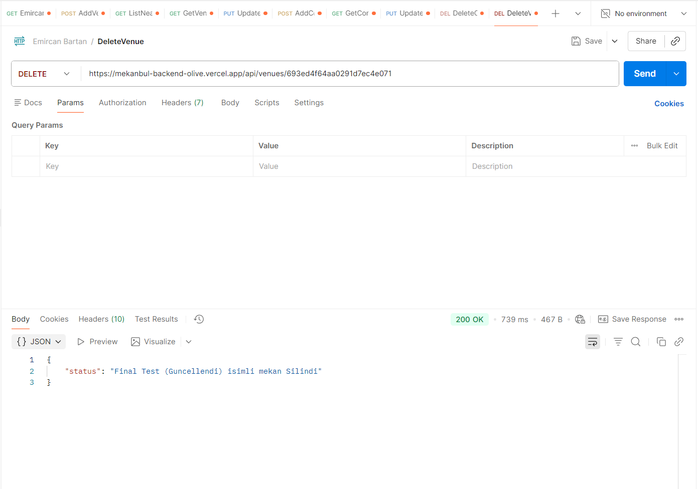
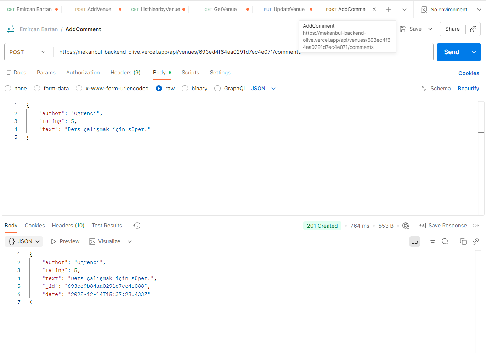
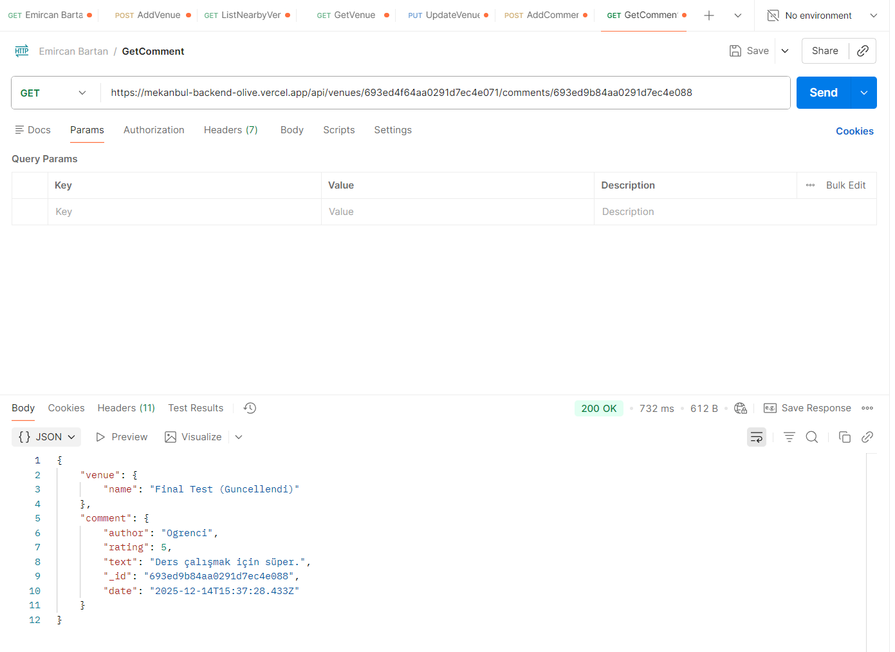
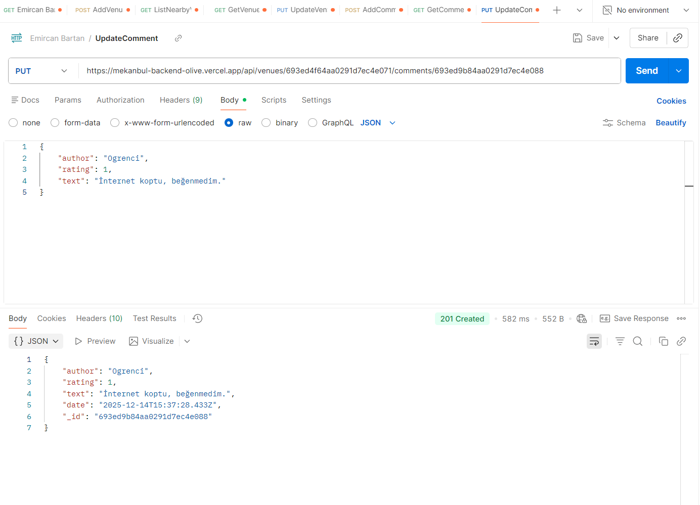
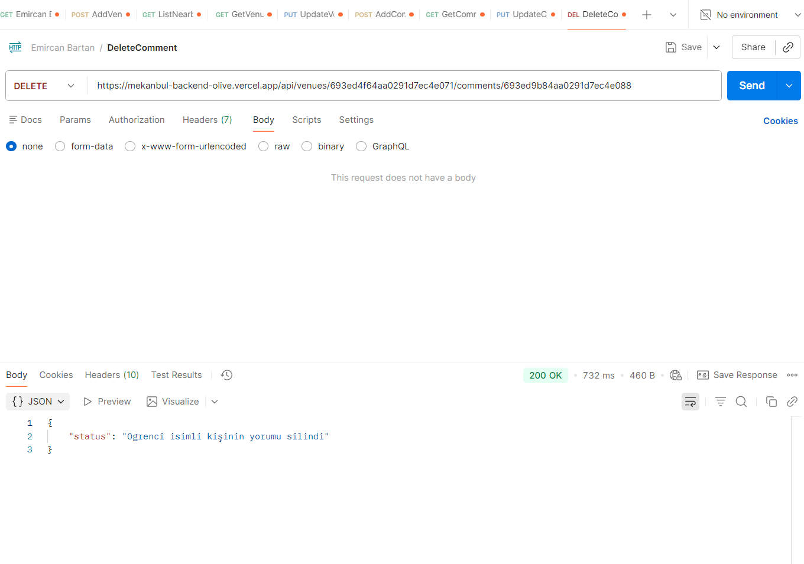

# Mekanbul Backend Projesi

**Geliştirici:** Emircan Bartan
**Canlı Demo:** https://mekanbul-backend-olive.vercel.app/

Bu proje Node.js, Express ve MongoDB kullanılarak geliştirilmiş, Vercel üzerinde çalışan bir REST API uygulamasıdır.

## API Test Ekran Görüntüleri (Kanıtlar)

Aşağıda Postman kullanılarak yapılan tüm API testlerinin başarılı sonuçları yer almaktadır.

### 1. Mekan (Venue) İşlemleri

**Mekan Ekleme (POST):**

**Mekanları Listeleme (GET):**

**Tek Mekan Getirme (GET):**

**Mekan Güncelleme (PUT):**

**Mekan Silme (DELETE):**

---

### 2. Yorum (Comment) İşlemleri

**Yorum Ekleme (POST):**

**Yorum Getirme (GET):**

**Yorum Güncelleme (PUT):**

**Yorum Silme (DELETE):**
